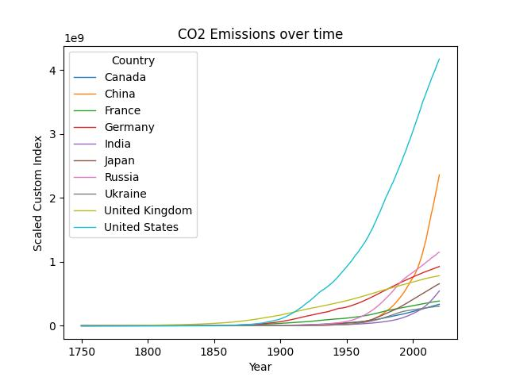

# Greenhouse Gases Emission Trend Analysis

## Description

This repository contains a Data Science project focused on analyzing two datasets: Worlwide CO2 emission from 1970 to 2020 for popular countries and O3 emission with the highest [AQI](https://en.wikipedia.org/wiki/Air_quality_index) value over the world.  The project aims to provide insights into the emission trends and their impact on the environment. The primary application of this analysis is a pollution viewer for CO2 and O3 emissions, allowing users to filter data by country.

## Data

The dataset used for this analysis includes historical data on CO2 and O3 emissions from 1970 to 2020 fetched through [kaggle](https://www.kaggle.com/).

## Data Science Analysis

### 1. CO2 Emission Trend Analysis

The first part of the analysis focuses on the trends of CO2 emissions over time for popular countries. The countries included in this analysis are:

- Canada
- China
- France
- Germany
- India
- Japan
- Russia
- Ukraine
- United Kingdom
- United States

#### Graph 1: CO2 Emission Trends Over Time

 

### 2. O3 Emission Analysis

The second part of the analysis explores O3 emissions, specifically highlighting the countries around the world with the highest Air Quality Index (AQI) values for O3.

#### Graph 2: O3 Emission and Highest AQI Values

## Thank You

 Thank you for exploring our Greenhouse Gases Emission Trend Analysis project! I appreciate your interest in understanding and addressing environmental challenges. If you have any questions, suggestions, or contributions, feel free to reach out.

## Contact

For inquiries or feedback, please contact:

- Name: Shreya Banik
- Email: shreyabanik2k@gmail.com
- GitHub: [kshreya2k](https://github.com/kshreya2k)

I look forward to hearing from you! 

